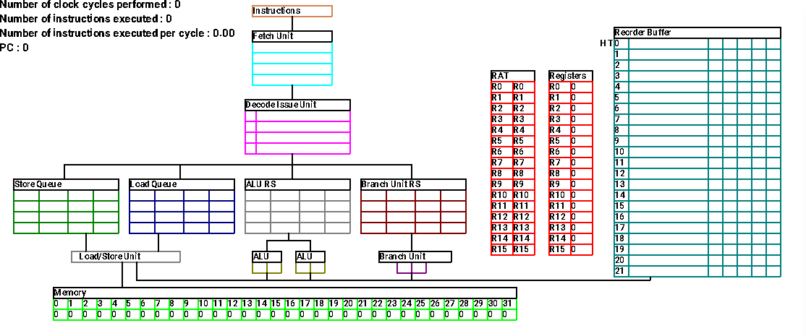

# Superscalar Processor

As part of the Advanced Computer Archicture unit at the University of Bristol, we were tasked with creating a simulator of a superscalar processor. I chose to write the simulator in C++.

## Features

Features of the processor include:

- A 5-stage pipeline (fetch, decode/issue, dispatch, execute, commit).
- Reservation stations to store instructions that are waiting for operands to be computed.
- Multiple execution units (load/store unit, ALUs, branch unit).
- Out-of-order execution of instructions using a Reorder Buffer.
- Register Renaming by use of a Register Allocation Table (RAT). This eliminates false data dependencies between instructions.
- Simple branch prediction (predicts that every branch will be taken).

I created my own assembly language and an assembler that converts assembly code into machine code.

I created a GUI to depict the instructions being executed in the processor. This was created using SDL. The GIF below shows the processor running a vector addition program.



## Setup (Linux)

Make sure you have the g++ compiler installed on your machine.

Install the required SDL packages with the following commands:
```
sudo apt-get install libsdl2-dev

sudo apt-get install libsdl2-image-dev

sudo apt-get install libsdl2-ttf-dev
```

## Compilation

Compile the processor with the command:
```
make
```

## Running the processor

Run the processor with the command:
```
./build/processor ./programs/kernels/vector_addition.mac
```
This will execute a vector addition program. Pressing enter in the console will execute one clock cycle. Pressing 'e' and then the enter button will cause the program to automatically run until completion.
