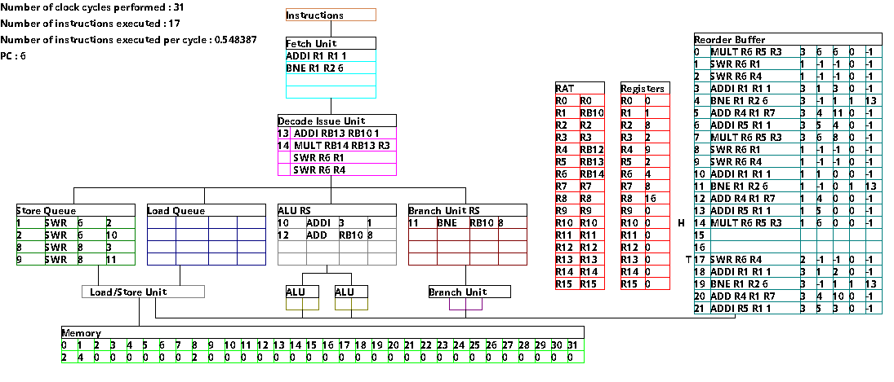

# Superscalar Processor

This repository contains my implementation of a superscalar processor. This was originally part of my coursework for the Advanced Computer Architecture masters unit at the University of Bristol. I have since extended it.

## Features

Features of the processor include:

- A 5-stage pipeline (fetch, decode/issue, dispatch, execute, commit)
- Reservation stations
- Multiple execution units (load/store unit, ALUs, branch unit)
- Out-of-order exeuction of instructions using a Re-order Buffer
- Register Renaming by use of a Register Allocation Table (RAT). This eliminates false data dependencies between instructions
- Simple branch prediction (predicts that every branch will be taken)
- A GUI to depict the instructions passing through the pipeline (created with SDL)

I also created my own assembly language and an assembler that converts assembly code into machine code.



## Setup

Install the required SDL packages with the following commands:
```
sudo apt-get install libsdl2-dev

sudo apt-get install libsdl2-image-dev

sudo apt-get install libsdl2-image-ttf
```

## Compilation

Compile the processor with the command:
```
make
```

## Running the processor

Run the processor the the command:
```
make run
```
This will execute a vector addition assembly program. Pressing the enter button in the terminal window will execute one clock cycle. Pressing 'e' and then the enter button will cause the program to automatically run until completion.
